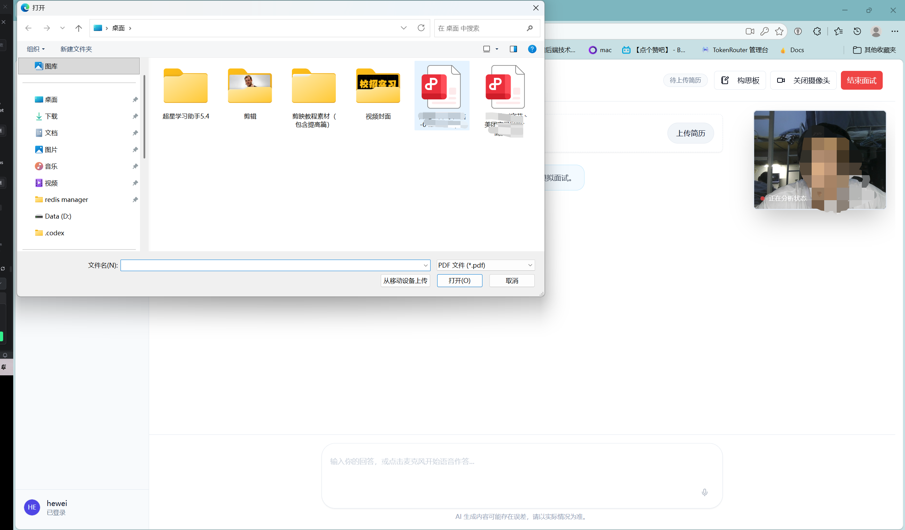
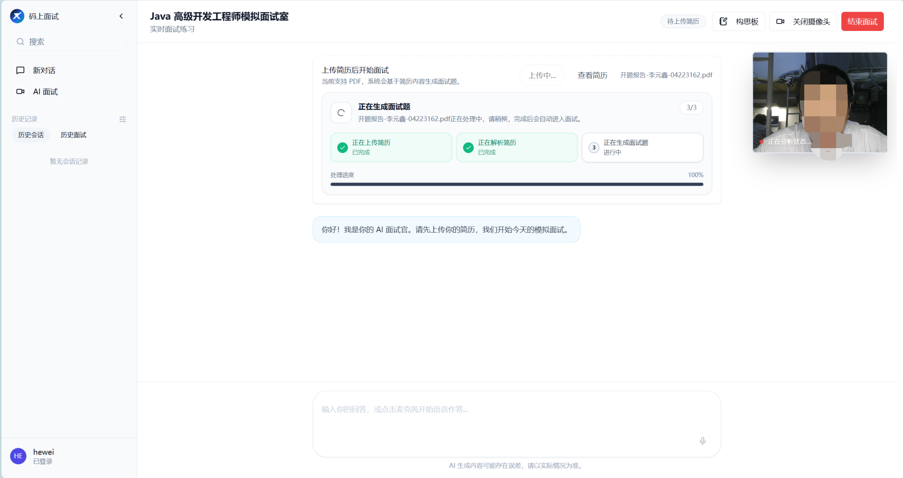
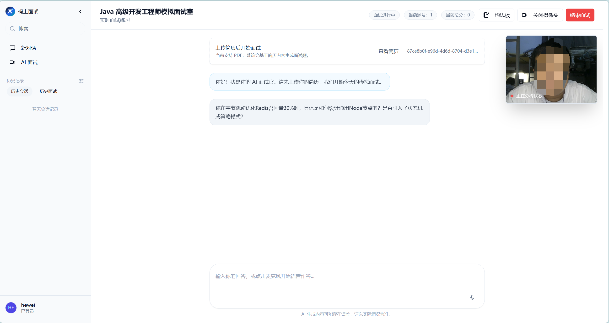
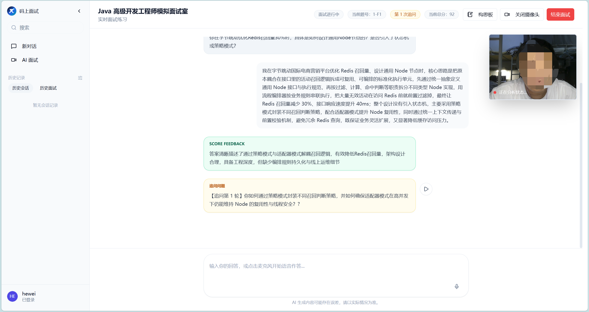
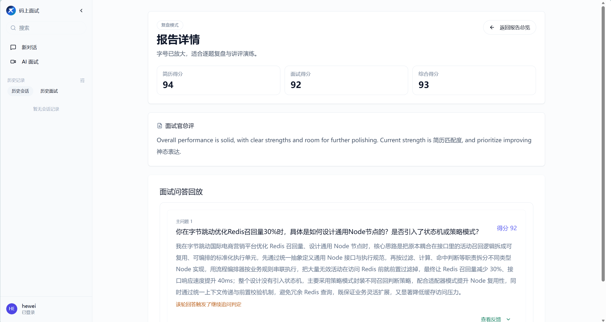
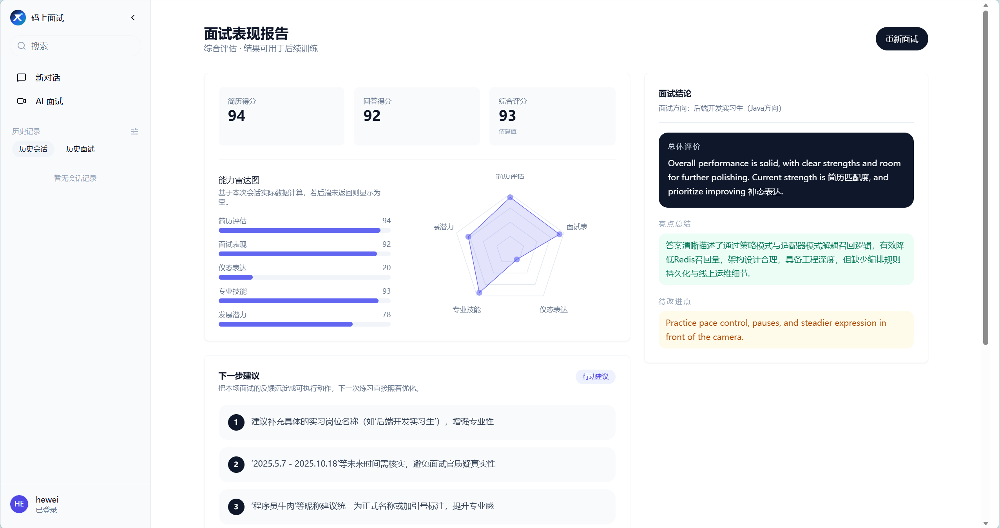

<div align="center">

**码上面试平台** - 基于大语言模型的简历分析、模拟面试服务


[](https://openjdk.org/)
[](https://spring.io/projects/spring-boot)
[](https://www.mysql.com/)
[](https://www.mongodb.com/)
[](https://redis.io/)


</div>


这是一个基于 Spring Boot 3 + Java 17 + Spring AI + MySQL + MongoDB + Redis 构建的 AI 智能助手后端项目，聚焦 AI 对话、智能体会话、模拟面试、实时语音转写和长文本语音合成等场景。项目采用模块化单体架构，支持 HTTP、SSE、WebSocket 多链路交互，兼顾业务完整性、工程规范性和开箱即用性。


## 系统架构：


## 功能特性

### 模拟面试模块

- **简历驱动出题**：上传 PDF 简历后，由「简历评分面试官」智能体解析简历并生成结构化面试题、简历评分与参考建议，题目与候选人经历深度关联。
- **多 Agent 协同评估**：内置 5 个星云工作流智能体（出题官、提问官、评分官、追问官、表情分析面试官），答题后由评分官同步返回分数与反馈，LiteFlow 规则链驱动追问裁决，模拟真实多轮深挖场景。
- **分布式 Single-flight**：同一次答题请求（评分/追问/抽题/神态分析）在多实例部署下只执行一次 AI 调用，支持结果回放、心跳保活、失败分类与超时接管，避免重复扣费。
- **长会话状态治理**：基于 MongoDB 热冷分层快照 + Redis 懒加载构建可恢复运行态体系，支持中断恢复、CAS 并发保护与异步补偿，解决长时间面试中途断线的状态丢失问题。
- **问答回放与雷达图**：面试结束后生成结构化面试记录，包含逐题回放（问题 → 回答 → 分数 → 反馈）、多维雷达图评分和 AI 综合建议。
- **神态分析**：支持上传摄像头截图，由表情识别智能体评估候选人仪态表现并纳入总分。
- **面试记录管理**：分页查询历史面试记录，支持按会话查看完整报告与评分详情。

### AI 对话模块

- **多模型统一接入**：基于 Spring AI 封装 `UniversalAiChatHandler`，通过 OpenAI 兼容协议统一接入 DeepSeek、星火、豆包等模型，运行时可切换。
- **SSE 流式响应**：基于 WebFlux Flux + SSE 实现打字机式流式输出，支持 DeepSeek `reasoning_content` 思维链展示。
- **会话管理**：支持创建、分页查询、结束、删除对话，消息持久化至 MongoDB，支持历史消息回溯。

### 智能体（Agent）模块

- **智能体配置管理**：支持运行时创建、更新、启停智能体配置（API Key / Secret / FlowId / 系统提示词等），按需绑定不同星云工作流。
- **Agent SSE 对话**：智能体对话走星辰大模型工作流接口，支持上下文多轮记忆与流式输出。
- **文件上传**：支持为智能体会话上传附件，由 `FileUploadUtil` 统一处理文件类型校验与持久化。

### 语音媒体模块

- **实时语音转写（ASR）**：基于 WebSocket + 讯飞大模型 AST 实现端到端实时语音识别，支持分段增量去重（TreeMap + seg_id/pgs 重叠比对）、`committedText / liveText / displayText` 三级文本渲染，解决重复文本与前缀误删问题。
- **长文本语音合成（TTS）**：集成讯飞长文本 TTS 异步接口，支持创建合成任务、轮询状态、同步等待三种模式，可配置音色、语速、音量与音频编码格式。
- **WebSocket 通信管理**：基于 JSR 356 `@ServerEndpoint` 实现会话级 WebSocket 连接，支持心跳保活、鉴权校验、二进制音频帧接收与服务端主动推送。

### 用户与权限模块

- **Sa-Token 认证**：基于 Sa-Token 实现登录 / 注册 / 登出，Token 持久化至 Redis 支持多实例共享登录态。
- **角色权限控制**：支持管理员角色分配，管理员接口通过 `@SaCheckRole` 注解鉴权。
- **WebSocket 鉴权**：WebSocket 连接建立时通过 Token 参数校验用户身份，支持多参数名兼容（token / Authorization / access_token）。

## 技术栈

### 后端技术

| 技术 | 版本 | 说明 |
| --- | --- | --- |
| Java | 17 | 开发语言 |
| Spring Boot | 3.4.4 | 应用框架 |
| Spring AI | 1.0.0 | AI 集成框架，统一多模型接入（DeepSeek / 星辰） |
| MyBatis-Plus | 3.5.9 | ORM 持久层框架 |
| MySQL | 8.0 | 关系型数据库 |
| MongoDB | 6.x | 文档数据库，存储运行态快照与对话消息 |
| Redis + Redisson | 3.27.2 | 分布式锁、布隆过滤器、限流、缓存、Stream 消息 |
| Sa-Token | 1.39.0 | 权限认证框架，集成 Redis 共享登录态 |
| Resilience4j | 2.2.0 | 熔断、限流、重试、舱壁隔离 |
| LiteFlow | 2.15.3.2 | 规则引擎，驱动追问裁决等业务规则链 |
| 讯飞 WebSDK | 3.0.2 | 语音转写（IAT）、OCR、表情识别、大模型 AST |
| OkHttp | 4.9.3 | HTTP / WebSocket 客户端 |
| WebSocket / SSE | - | 实时 ASR 双向通信、AI 流式响应 |
| Maven | 3.6.3+ | 构建工具 |

1.为什么要用Redis和Mongodb？
   - Redis 用于存储会话状态、分布式锁、缓存等，提供高并发、低延迟的访问。
   - MongoDB 用于存储运行态快照、对话消息等，支持文档存储、查询与聚合。


### 运维与部署

| 技术 | 说明 |
| --- | --- |
| Docker Compose | 容器化一键部署（MySQL + MongoDB + Redis + 应用） |
| GitHub Actions | CI 流水线，自动执行单元测试与构建 |

### 前端技术
| 技术 | 版本 | 说明 |
| --- | --- | --- |
| React | 19.2 | UI 框架 |
| TypeScript | 5.9 | 开发语言 |
| Vite | 7.3 | 构建工具 |
| Tailwind CSS | 3.4 | 样式框架（配合 shadcn/ui CSS 变量体系） |
| React Router DOM | 7.13 | 路由管理 |
| Framer Motion | 12.35 | 动画库 |
| Lucide React | 0.564 | 图标库 |
| Redux Toolkit | 2.11 | 全局状态管理 |
| React Redux | 9.2 | Redux React 绑定 |
| TanStack React Query | 5.90 | 服务端状态 / 数据请求缓存 |
| Axios | 1.13 | HTTP 请求 |
| Zod | 4.3 | 数据校验 / 表单 Schema |
| React Hook Form | 7.71 | 表单管理 |
| React PDF | 10.4 | PDF 简历预览 |
| React Markdown | 10.1 | Markdown 渲染（AI 回复展示） |
| Vitest | 4.0 | 单元测试框架 |
| Radix UI | — | 无障碍原语组件（shadcn/ui 基础） |

## 测试与 CI

统一校验入口：

```bash
./mvnw -B -ntp clean verify
```

当前 CI 覆盖：

- Maven 构建与测试
- JDK 17 基线校验
- 仓库元数据与文档格式检查

工作流文件见 [`.github/workflows/backend-ci.yml`](.github/workflows/backend-ci.yml)。

## 效果展示

### 简历与面试

首页登录：


上传简历：



在线解析并出题：



面试入口：


提问环节：



追问环节：



结果复盘：



面试结果分析：


